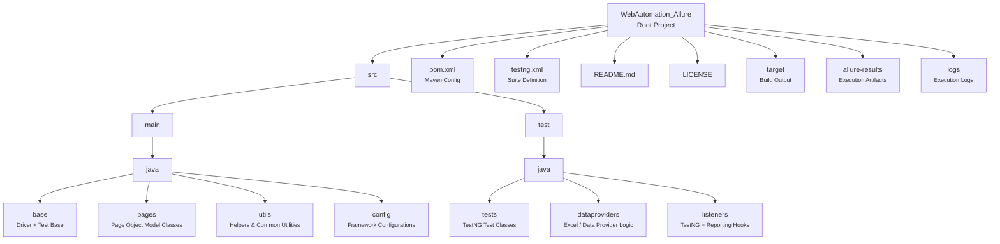

# WebAutomation_Allure

[](LICENSE.md)
[](https://github.com/GladsonAntony/WebAutomation_Allure/stargazers)
[](https://github.com/GladsonAntony/WebAutomation_Allure/network/members)

## 📌 Overview

**WebAutomation_Allure** is a hybrid web automation framework implemented in **Java** using **Selenium WebDriver** and **TestNG**.  
This framework supports **multiple browsers and platforms**, uses **Allure Reporting**, and follows the **Page Object Model (POM)** design pattern for scalable, maintainable test automation.

---

## 🛠️ Features

- 🚀 **Cross-Browser Support**
  - Google Chrome
  - Mozilla Firefox
  - Microsoft Edge
  - Internet Explorer
  - Opera
  - HTMLUnit (Headless)


- 🧠 **Hybrid Design Pattern**
  - Page Object Model (POM)
  - Modular test layers


- 📊 **Reporting**
  - Allure Reports for visually rich test results


- 📌 **Data-Driven Testing**
  - Excel-based TestNG `@DataProviders`


- 🎥 Video recording support through Monte Repack integration


- 🧪 Structured TestNG suite

---

## 📁 Project Structure



WebAutomation_Allure/
├─ src/
│   ├─ main/java/...         # Page Objects & Utils
│   └─ test/java/...         # Test classes
├─ pom.xml                  # Maven config
├─ testng.xml              # TestNG suite config
├─ README.md
└─ LICENSE.md


---

## 🚀 Getting Started

### Prerequisites

Make sure you have the following installed:

- Java JDK 8+
- Maven
- Allure Commandline (optional, for generating reports)
- Browser Drivers - Now Managed directly from Selenium
- Preferred IDE (IntelliJ / Eclipse / VSCode)

---

## ▶️ How to Run Tests

Clone the repository:

```bash
    git clone https://github.com/GladsonAntony/WebAutomation_Allure.git
````

Run tests using Maven:

```bash
    mvn clean test
```

---

## 🧪 Browser Setup

By default, a browser is picked from the configuration file.
Override during runtime using:

```bash
    mvn clean test -DBrowserType=Chrome      # Chrome
    mvn clean test -DBrowserType=Firefox     # Firefox
    mvn clean test -DBrowserType=IE          # Internet Explorer
    mvn clean test -DBrowserType=Opera       # Opera
    mvn clean test -DBrowserType=Edge        # Edge
    mvn clean test -DBrowserType=Unit        # HTMLUnit (Headless)
```

---

## 📊 Allure Report Generation

After test execution:

Generate the site:

```bash
    mvn site
```

Open the Allure report:

```bash
    mvn allure:serve
```

Or host it:

```bash
mvn jetty:run -Djetty.http.port=9988
```

---

## 📦 Using `@DataProvider`

Excel test data is supported in two ways:

### 1️⃣ Using a single workbook (`TestData.xlsx`)

Sheet names must match the test method names:

```java
    @DataProvider(name="multiSheetExcelRead", parallel=true)
    public static Object[][] multiSheetExcelRead(Method method) throws Exception {
        File file = new File("./src/test/resources/Excel Files/TestData.xlsx");
        String sheetName = method.getName();
        return ExcelUtils.getTableArray(file.getAbsolutePath(), sheetName);
    }
```

### 2️⃣ Workbook per test method name

```java
    @DataProvider(name="excelSheetNameAsMethodName", parallel=true)
    public static Object[][] excelSheetNameAsMethodName(Method method) throws Exception {
        File file = new File("./src/test/resources/Excel Files/" + method.getName() + ".xlsx");
        return ExcelUtils.getTableArray(file.getAbsolutePath());
    }
```

---

## 📌 Best Practices

✔ Keep test data separate from code
✔ Use descriptive test names
✔ Follow consistent naming conventions
✔ Modularize page objects and utilities
✔ Utilize Allure attachments for screenshots and logs

---

## 📜 License

This project is licensed under the **Apache-2.0 License** — see the [LICENSE.md](LICENSE.md) file for details.

---

## 💬 Contributions

Contributions, issues, and feature requests are welcome!
Feel free to check issues and submit pull requests.

---

## 📌 Acknowledgements

This framework is based on industry standards for scalable automation solutions.

---
